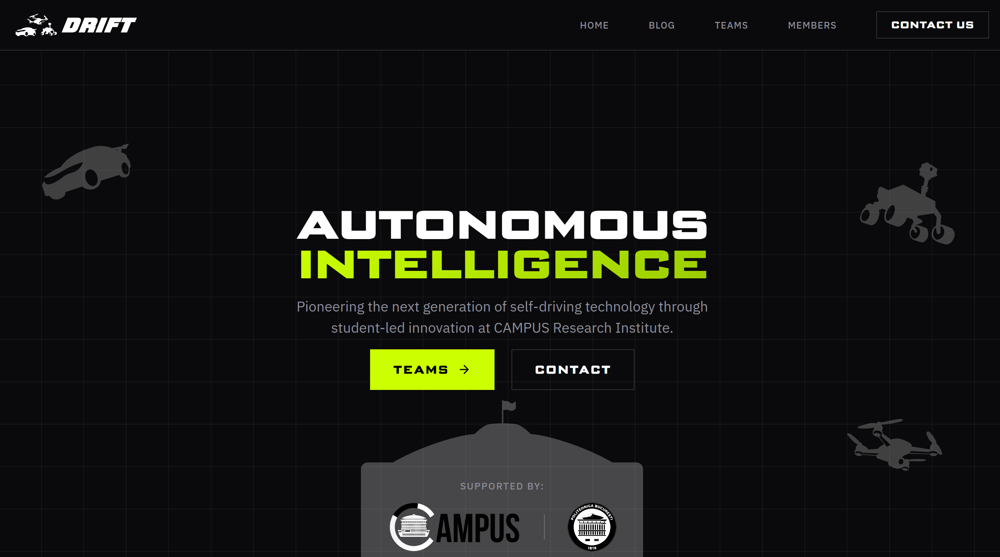

# Drift Lab Website

Official website for Drift Lab, the Autonomous Vehicles Research Laboratory at CAMPUS Research Institute (Politehnica University of Bucharest).

Live: [https://driftlab.ro](https://driftlab.ro)



## Run locally

```bash
bun install
bun run dev
```

The site runs at `http://localhost:4321`.

## Add a blog post

1. Create a new `.md` file in `src/content/blog/`.
2. Add the post frontmatter (`title`, `description`, `pubDate`, `author`, etc.) and write the content.
3. Save the file and check it locally with `bun run dev`.

If your project uses images for blog posts, place them in `public/images/` and reference them from the post.

## Content change policy

For any content changes outside blog posts, create a GitHub issue and assign it to **Lazar**.
